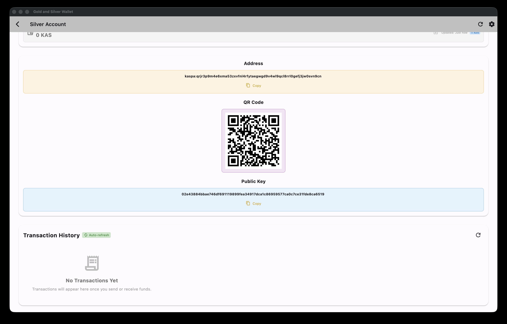

# Gold and Silver Wallet - Professional HD Cold Wallet

A professional Flutter-based hierarchical deterministic (HD) cold wallet implementing BIP39/BIP32/BIP44 standards for secure offline cryptocurrency key management with multiple entropy strategies and comprehensive multi-wallet support.

## 📱 Screenshots

<div align="center">

### Wallet Creation & Security


### Mnemonic & Account Setup


### Wallet Management & Features




</div>

## ✨ Key Features

### 🎲 Multiple Entropy Strategies
- **System Random**: Cryptographically secure RNG (fastest, recommended)
- **Dice Rolls**: Physical 6-sided dice for true randomness (most secure)
- **Card Shuffle**: Shuffle a 52-card deck and record the order (~225 bits entropy)
- **Dice & Card Hybrid**: Combine card shuffle and dice rolls for maximum security

### 📝 Flexible Mnemonic Lengths
- **12 words** (128-bit): Standard security
- **15 words** (160-bit): Enhanced security
- **18 words** (192-bit): Strong security
- **21 words** (224-bit): Very strong security
- **24 words** (256-bit): Maximum security ⭐ Recommended

### 🗂️ Multi-Wallet Management
- Create unlimited wallets, each with unique recovery phrase
- Import existing BIP39 wallets (12-24 words)
- Organize wallets with custom names
- Track creation dates and account counts

### 💼 Multi-Account System
- Multiple accounts per wallet
- Different cryptocurrencies in same wallet
- Unlimited addresses per account
- BIP44-compliant derivation paths

### 🪙 Multi-Asset Support
| Cryptocurrency | Symbol | Coin Type | Address Format |
|----------------|--------|-----------|----------------|
| Bitcoin | BTC | 0 | P2PKH (1...) |
| Kaspa | KAS | 111111 | Bech32 (kaspa:...) |

### 📡 Live Balances & History
- Auto-refresh balances in background (every 30–45 seconds depending on screen)
- Paginated transaction history with confirmations and fees
- Explorer deep-links for addresses and transactions

### 🔍 Wallet Discovery Scanner
- Scan multiple account indexes, address indexes, and signature types (Schnorr/ECDSA)
- Detects previously used addresses with non-zero balances
- Add discovered accounts to your wallet with one tap

## 🔐 Address Generation & Signature Types

### Signature Type Support

The wallet supports two signature types for cryptographic operations, ensuring compatibility with different wallet implementations:

#### **Schnorr Signatures (Default)**
Used by most standard wallets and hardware devices:
- **Standard Wallets**: Native implementations using Schnorr signatures
- **Ledger Hardware Wallets**: Hardware wallet integration with Schnorr
- **Kaspium Wallet**: Popular Kaspa wallet with Schnorr support
- **Kasware Wallet**: Native Kaspa wallet using Schnorr signatures
- **OneKey Wallet**: Multi-chain wallet with Schnorr support

**Technical Details:**
- Uses x-coordinate only (32 bytes) from public key
- Version byte: 0 (PubKey)
- Algorithm: rusty-kaspa bech32 encoding
- Signature type: Schnorr (BIP340)

#### **ECDSA Signatures (Tangem)**
Used by Tangem hardware wallets:
- **Tangem Wallet**: Hardware wallet using ECDSA signatures

**Technical Details:**
- Uses full serialized public key (33 bytes)
- Version byte: 1 (PubKeyECDSA)  
- Algorithm: CashAddrBech32 encoding
- Signature type: ECDSA (secp256k1)

### **Address Generation Workflow**

1. **Seed Derivation**: BIP39 mnemonic → BIP32 master key
2. **Path Derivation**: BIP44 path `m/44'/111111'/0'` for Kaspa
3. **Public Key Extraction**: secp256k1 public key from derived private key
4. **Signature Type Selection**: Choose between Schnorr (Default) or ECDSA (Tangem)
5. **Payload Preparation**: 
   - Schnorr: x-coordinate (32 bytes) + version 0
   - ECDSA: full public key (33 bytes) + version 1
6. **Encoding Process**:
   - Convert payload to 5-bit groups
   - Calculate checksum using polymod algorithm
   - Encode using Kaspa charset
   - Format as `kaspa:...` address

### **Mathematical Foundation**

The address generation follows strict cryptographic standards:
- **BIP39**: Mnemonic phrase generation and validation
- **BIP32**: Hierarchical deterministic key derivation
- **BIP44**: Multi-account structure for different cryptocurrencies
- **Bech32**: Base32 encoding with error detection
- **secp256k1**: Elliptic curve cryptography for key generation

### **Security Considerations**

- **Offline Generation**: All addresses generated without network access
- **Deterministic**: Same seed always produces same addresses
- **Signature Type Compatibility**: Supports both Schnorr and ECDSA signature types
- **Cryptographic Standards**: Uses industry-standard algorithms
- **Error Detection**: Bech32 encoding includes checksum validation

### 🎨 Professional UI/UX
- Step-by-step wallet creation wizard
- Clear security warnings and confirmations
- Show/hide sensitive information
- QR code generation for easy sharing
- Address navigation (+/− for unlimited addresses)
- Color-coded security indicators

### 🔐 Security-First Design
- Offline-first architecture (no network required)
- Industry-standard secp256k1 cryptography
- Hidden private keys by default
- Confirmation prompts for critical actions
- Clear visual warnings for sensitive data
- Encrypted persistence with a master password (AES-256 + PBKDF2)
- Password setup and unlock screens on app start

## 🚀 Quick Start

### Prerequisites

**macOS / Linux:**
- Flutter SDK in PATH
- Command line tools: `git`, `autoconf`, `automake`, `libtool`
- For macOS: Xcode command line tools
- For Android: Android Studio with NDK

**Windows:**
- Flutter SDK in PATH
- Visual Studio with C++ build tools
- CMake
- Git

### Build and Run (One Command)

**macOS / Linux / iOS / Android:**
```bash
# Run on macOS
./start.sh --platform=macos

# Run on iOS Simulator
./start.sh --platform=ios-simulator

# Run on iOS Device
./start.sh --platform=ios

# Run on Android Emulator
./start.sh --platform=android-simulator

# Run on Android Device
./start.sh --platform=android

# Run on Linux
./start.sh --platform=linux
```

**Windows:**
```cmd
REM Run on Windows
start.bat --platform=windows
```

The script automatically:
1. ✅ Clones secp256k1 library (if needed)
2. ✅ Builds native libraries for your platform
3. ✅ Gets Flutter dependencies
4. ✅ Builds and launches the app

### Skip Build (if libraries already exist)

```bash
# Skip building native libraries
./start.sh --platform=macos --skip-build
```

## 📁 Project Structure

```
ColdifyWallet/
├── secp256k1/                 # Bitcoin Core's secp256k1 C library
├── secp256k1_wrapper/         # FFI wrapper package
│   ├── lib/
│   │   ├── secp256k1_wrapper.dart
│   │   └── src/
│   │       ├── secp256k1_bindings.dart  # FFI bindings
│   │       └── secp256k1.dart           # High-level API
│   └── native/                # Platform-specific libraries
│       ├── macos/libsecp256k1.dylib     # macOS library
│       ├── ios/libsecp256k1.dylib       # iOS Simulator library
│       ├── ios-device/libsecp256k1.dylib # iOS Device library
│       ├── android/jniLibs/   # Android libraries (all ABIs)
│       │   ├── arm64-v8a/
│       │   ├── armeabi-v7a/
│       │   ├── x86_64/
│       │   └── x86/
│       ├── linux/libsecp256k1.so        # Linux library
│       └── windows/secp256k1.dll        # Windows library
├── hd_wallet/                 # HD wallet package
│   ├── lib/
│   │   ├── hd_wallet.dart
│   │   └── src/
│   │       ├── hd_wallet.dart
│   │       ├── bip39/
│   │       │   ├── mnemonic.dart        # BIP39 implementation
│   │       │   ├── wordlist.dart        # 2048 English words
│   │       │   └── entropy_source.dart  # Multiple strategies
│   │       ├── bip32/
│   │       │   ├── hd_key.dart          # HD key derivation
│   │       │   └── derivation_path.dart # Path parsing
│   │       └── crypto/
│   │           ├── coin_type.dart       # Multi-asset support
│   │           └── address_generator.dart
│   └── pubspec.yaml
├── gold_and_silver_wallet/            # Flutter UI application
│   ├── lib/
│   │   ├── main.dart          # App entry point
│   │   ├── models/            # Data models
│   │   │   ├── account_model.dart
│   │   │   ├── balance_model.dart
│   │   │   ├── network_model.dart
│   │   │   ├── transaction_model.dart
│   │   │   └── wallet_model.dart
│   │   ├── services/          # State management & encryption
│   │   │   ├── wallet_manager.dart
│   │   │   ├── wallet_storage.dart
│   │   │   ├── encrypted_storage.dart
│   │   │   ├── network_service.dart
│   │   │   ├── transaction_service.dart
│   │   │   └── security_service.dart
│   │   ├── screens/           # UI screens
│   │   │   ├── home_screen.dart
│   │   │   ├── create_wallet_screen.dart
│   │   │   ├── entropy_input_screen.dart
│   │   │   ├── mnemonic_display_screen.dart
│   │   │   ├── import_wallet_screen.dart
│   │   │   ├── wallet_detail_screen.dart
│   │   │   ├── account_view_screen.dart
│   │   │   ├── password_setup_screen.dart
│   │   │   ├── password_unlock_screen.dart
│   │   │   └── settings_screen.dart
│   │   ├── widgets/           # Reusable UI components
│   │   │   ├── animated_fab.dart
│   │   │   ├── modern_card.dart
│   │   │   └── provider_selection_widget.dart
│   │   └── theme/
│   │       └── app_theme.dart
│   ├── android/               # Android platform files
│   ├── ios/                   # iOS platform files
│   ├── macos/                 # macOS platform files
│   ├── linux/                 # Linux platform files
│   ├── windows/               # Windows platform files
│   └── pubspec.yaml
├── flutter/                   # Local Flutter SDK (auto-cloned)
├── build/                     # Native library build outputs
├── start.sh                   # Complete setup and run script (Unix)
├── start.bat                  # Complete setup and run script (Windows)
├── release.sh                 # Release build and packaging script
├── RELEASE.md                 # Release notes and changelog
└── README.md                  # This file
```

## 💡 Usage Examples

### Create Wallet with Maximum Security

**Option 1: Dice Rolls (Most Secure)**
```
1. Open app → "Create New Wallet"
2. Select "24 words" + "Dice Rolls"
3. Roll dice 99+ times
4. Enter: 1 4 2 6 3 5 1 2 4 6 ...
5. Generate and save mnemonic
6. Write down all 24 words
```

**Option 2: Card Shuffle (High Security)**
```
1. Open app → "Create New Wallet"
2. Select "24 words" + "Card Shuffle"
3. Shuffle a 52-card deck thoroughly (7+ riffle shuffles)
4. Record the order: AS,7D,KC,2H,QH,9C,JD,...
5. Enter all 52 cards comma-separated
6. Generate and save mnemonic
7. Write down all 24 words
```

**Option 3: Dice & Card Hybrid (Maximum Security)**
```
1. Open app → "Create New Wallet"
2. Select "24 words" + "Dice & Card Hybrid"
3. Shuffle a 52-card deck and record: AS,7D,KC,2H,...
4. Roll dice 20-50 times and record: 3,6,2,1,4,5,...
5. Enter in format: cards|dice
   Example: AS,7D,KC,2H,QH,9C,JD,...|3,6,2,1,4,5,2,6,3,1,...
6. Generate and save mnemonic
7. Write down all 24 words
```

### Import Existing Wallet

```
1. Open app → "Import Wallet"
2. Enter recovery phrase (12-24 words)
3. Automatic validation
4. Access all accounts
```

### Create Bitcoin Gold Account

```
1. Select wallet
2. "Add Account"
3. Name: "Main BTC"
4. Select: Bitcoin (BTC)
5. Account Index: 0
```

### View Addresses

```
1. Tap account
2. See address + QR code
3. Use +/− to navigate addresses
4. Copy or scan QR code
```

## 🏗️ Architecture

### Modular Design

Three independent packages:

1. **secp256k1_wrapper** (Standalone)
   - FFI bindings to C library
   - Key generation and signing
   - Platform-specific library loading

2. **hd_wallet** (Standalone)
   - BIP39: Mnemonic generation with 4 entropy strategies
     - System Random (cryptographically secure RNG)
     - Dice Rolls (physical dice for true randomness)
     - Card Shuffle (52-card deck shuffle)
     - Dice & Card Hybrid (combines cards and dice)
   - BIP32: HD key derivation
   - BIP44: Multi-account hierarchy
   - Multi-asset address generation

3. **gold_and_silver_wallet** (Flutter App)
   - Material Design 3 UI
   - Provider state management
   - Multi-wallet/account management
   - QR code display

### State Management

- **Provider** package for reactive state
- `WalletManager` service for centralized wallet/account management
- `ChangeNotifier` for UI updates

## 📋 BIP Standards

### BIP39 - Mnemonic Code
- 256-bit entropy → 24 words (recommended)
- Full 2048-word English wordlist (hardcoded)
- Checksum validation
- PBKDF2-HMAC-SHA512 for seed generation
- **4 Entropy Generation Strategies**:
  - **System Random**: Uses device's secure RNG (fastest)
  - **Dice Rolls**: Physical 6-sided dice (~2.585 bits per roll)
  - **Card Shuffle**: 52-card deck shuffle (~225 bits total)
  - **Dice & Card Hybrid**: Combines both sources with SHA-512 hashing

### BIP32 - Hierarchical Deterministic Wallets
- Master key derived from seed
- Child key derivation with chain codes
- Hardened and non-hardened derivation
- Unlimited address generation from one seed

### BIP44 - Multi-Account Hierarchy
- Standard path: `m / 44' / coin_type' / account' / change / address_index`
- Purpose: 44' (BIP44)
- Coin types: 0=BTC, 111111=KAS
- Account: 0, 1, 2, ... (multiple accounts supported)
- Change: 0 (receiving addresses)
- Index: 0, 1, 2, ... (unlimited addresses)
- Custom derivation paths also supported

## 🔐 Security Best Practices

### ✅ DO

- Generate on offline/air-gapped device
- Use dice rolls, card shuffle, or hybrid for maximum security
- Shuffle cards thoroughly (7+ riffle shuffles recommended)
- Roll dice on a flat, random surface
- Write recovery phrase on paper (never digital)
- Store in multiple secure physical locations
- Test with small amounts first
- Verify addresses before sending funds

### ❌ DON'T

- Never share private keys or recovery phrase
- Don't store phrase in cloud or digital form
- Don't screenshot or photograph phrase
- Don't use on compromised devices
- Don't skip backup verification
- Don't lose recovery phrase (no recovery!)

⚠️ **CRITICAL**: Losing the recovery phrase means losing ALL funds permanently!

## 🛠️ Development

### Clean Build from Scratch

```bash
# Remove everything and rebuild
rm -rf secp256k1 build secp256k1_wrapper/native

# Clean Flutter packages
cd gold_and_silver_wallet && flutter clean && cd ..
cd hd_wallet && flutter clean && cd ..
cd secp256k1_wrapper && flutter clean && cd ..

# Build and run (builds libraries automatically)
./start.sh --platform=macos
```

### Build for Multiple Platforms

```bash
# Build for all platforms at once
./start.sh --platform=macos
./start.sh --platform=ios-simulator
./start.sh --platform=android

# On Windows
start.bat --platform=windows
```

### Tips
- To skip native library rebuilds, pass `--skip-build` to `start.sh`
- If Flutter is already in PATH, the local `flutter/` clone is not required

### Build for Release

```bash
# The start script handles debug builds
# For release builds, manually run:
cd gold_and_silver_wallet

# macOS Release
flutter build macos --release

# iOS Release
flutter build ios --release

# Android Release
flutter build apk --release
flutter build appbundle --release

# Windows Release
flutter build windows --release

# Linux Release
flutter build linux --release
```

### Release Builds via Top-Level Script

Use the unified `release.sh` to build, bundle, and optionally sign artifacts:

```bash
# Examples
./release.sh --platform=macos --bundle --sign
./release.sh --platform=ios --bundle --sign
./release.sh --platform=android --bundle
./release.sh --platform=linux --bundle
./release.sh --platform=windows --bundle

# Options
#   --version=<semver>       Override version (else read from pubspec)
#   --build-number=<int>     Override build number (auto-increment default)
#   --skip-build             Skip native lib build if already present
#   --bundle                 Create installer/bundle (DMG/IPA/AAB/AppImage/NSIS)
#   --sign                   Codesign macOS/iOS outputs
#   --output=<dir>           Output directory (default: ./releases/)
```

## ⚠️ Disclaimer

This software is provided "as is" without any warranty of any kind, express or implied. Use at your own risk. The authors and contributors are not responsible for any loss of funds, security breaches, or other damages resulting from the use of this software.

**This is a development project.** Always:
- Test thoroughly with small amounts first
- Audit the code yourself before trusting with significant funds
- Use proper security practices for production use
- Consider professional security audit for production deployments

## 📄 License

This project uses the Bitcoin Core secp256k1 library, which is licensed under the MIT License.

## 🙏 Acknowledgments

- **Bitcoin Core** for the secp256k1 library
- **BIP39/BIP32/BIP44** specification authors
- **Flutter** and **Dart** teams
- **PointyCastle** cryptography library
- **Provider** package for state management
- **qr_flutter** for QR code generation
- The entire cryptocurrency community

## 🤝 Contributing

Contributions are welcome! Please:
1. Fork the repository
2. Create a feature branch
3. Make your changes
4. Add tests if applicable
5. Submit a pull request

## 📞 Support

- **GitHub Issues**: Report bugs or request features
- **Documentation**: Check FEATURES.md and QUICK_START.md
- **Security Issues**: Report privately to maintainers

---

**Built for secure offline cryptocurrency key management**

**Remember: Your keys, your crypto. Your phrase, your responsibility.** 🔐
